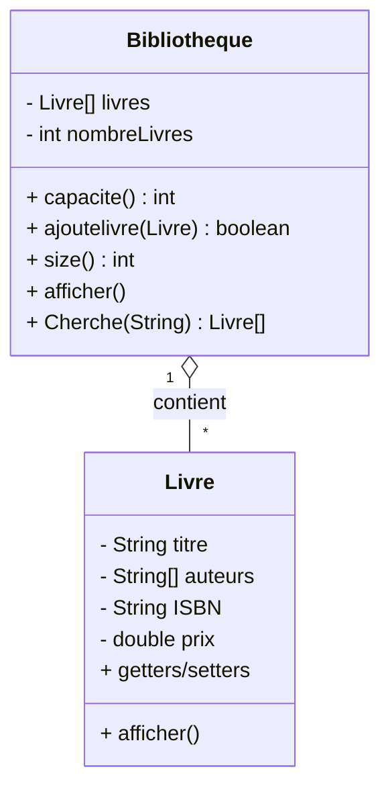

# Système de Gestion de Bibliothèque

Ce projet implémente un système simple de gestion de bibliothèque en Java. Il permet de gérer une collection de livres avec leurs informations détaillées.

## Structure du Projet

Le projet est composé de trois classes principales :

1. **Livre.java** : Représente un livre avec ses attributs et méthodes.
2. **Bibliotheque.java** : Gère une collection de livres avec des méthodes pour ajouter, afficher et rechercher.
3. **Main.java** : Programme principal pour tester les fonctionnalités.

## Fonctionnalités

### Classe Livre
- Stockage des informations d'un livre (titre, auteurs, ISBN, prix)
- Maximum 5 auteurs par livre
- Méthodes pour afficher les détails d'un livre

### Classe Bibliotheque
- Gestion d'une collection de livres avec une capacité maximale
- Ajout de nouveaux livres
- Affichage de tous les livres de la bibliothèque
- Recherche de livres par auteur

## Comment Utiliser

1. Compiler les fichiers Java :
```
javac src/*.java
```

2. Exécuter le programme principal :
```
java -cp src Main
```

## Exemple d'Utilisation

```java
// Création d'un livre
String[] auteurs = {"Victor Hugo", "Alexandre Dumas"};
Livre livre = new Livre("Les Misérables", auteurs, "978-2-07-040089-2", 150.50);

// Création d'une bibliothèque
Bibliotheque biblio = new Bibliotheque(10);

// Ajout du livre
biblio.ajoutelivre(livre);

// Affichage de la bibliothèque
biblio.afficher();

// Recherche par auteur
Livre[] livresTrouves = biblio.Cherche("Victor Hugo");
```

## Diagramme de Classes



## Auteur

Ce projet a été développé dans le cadre d'un exercice de programmation orientée objet en Java.
